# 🛡️ Safety Intelligence: Tactical Human Scream Detection

[](https://pytorch.org/)
[](https://streamlit.io/)
[](https://optuna.org/)

A professional-grade security framework designed for real-time human distress detection. This system utilizes a unique **Hybrid Neural Ensemble**, combining global statistical frequency analysis with temporal graph structural intelligence to distinguish human shrieks from environmental noise with high precision.

---

## 🏗️ Neural Architecture Overview

The system processes audio through two distinct "intellectual branches" before reaching a final ensemble decision.

### 🧩 Hybrid Ensemble Workflow

```mermaid
graph TD
    subgraph Input ["Audio Input (22.05kHz)"]
        A[Raw Signal] --> B[Sliding Window Segmentation]
    end

    B --> C[Feature Extraction Layer]
    
    subgraph Features ["Feature Space"]
        C --> D1[20 MFCCs]
        C --> D2[Zero Crossing Rate]
        C --> D3[Spectral Centroid]
        C --> D4[RMS Energy]
        C --> D5[Spectral Bandwidth]
        C --> D6[Spectral Flatness]
    end

    D1 & D2 & D3 & D4 --> E[Graph Construction]
    D1 --> F[Global Averaging]

    subgraph Models ["Hybrid Neural Ensemble"]
        E --> G[GGNN Branch]
        F --> H[SVM Branch]
        
        subgraph GGNN ["Gated Graph Neural Network"]
            G1[Linear Projection] --> G2[GatedGraphConv - MPS]
            G2 --> G3[Global Mean Pooling]
            G3 --> G4[MLP Head]
        end
        
        subgraph SVM ["Statistical Branch"]
            H1[Standard Scaler] --> H2[RBF Kernel SVM]
        end
    end

    G4 --> I[Ensemble Decision]
    H2 --> I

    subgraph Output ["Tactical Dashboard"]
        I --> J{Scream Detected?}
        J -->|Yes| K[🔴 ALERT: High-Intensity Vocal Event]
        J -->|No| L[🟢 STATUS: Ambient / Safe]
    end

    style K fill:#ff2e2e,color:#fff,stroke:#000
    style L fill:#00ff9d,color:#000,stroke:#222
    style Models fill:#080a0f,color:#fff,stroke:#333
    style GGNN fill:#1a1f2e,color:#fff,stroke:#444
    style SVM fill:#1a1f2e,color:#fff,stroke:#444
```



### 1. Statistical Branch (SVM)
*   **Mechanism**: Operates on the global spectral "fingerprint" of the audio segment.
*   **Kernel**: Uses a **Radial Basis Function (RBF)** kernel to project 20-dimensional MFCC averages into a high-dimensional space where "timbre" differences are linearly separable.
*   **Role**: Acts as the first-order filter to detect the frequency profile typical of human vocal distortion.

### 2. Structural Branch (GGNN)
*   **Mechanism**: Models audio as a **Temporal Adjacency Graph**. Each 20ms frame is a node; bidirectional edges connect chronological neighbors.
*   **Message Passing Scheme (MPS)**: Uses **Gated Graph Convolutions** to pass hidden states between nodes. This allows the network to "understand" the sustain and intensity decay of a sound over time.
*   **Role**: Identifies the specific temporal "shape" of a scream (onset, sustained intensity, and vocalic texture) that distinguishes it from sudden mechanical impacts or white noise.

---

## 🚀 Key Features

*   **⚡ Real-Time Tactical HUD**: Low-latency monitoring via WebRTC with live spectral visualization.
*   **📈 Advanced Neural Ensemble**: Achieved **87.3% GGNN accuracy** using Gated Graph Convolutions and Batch Normalization.
*   **🤖 Auto-Hyperparameter Tuning**: Powered by **Optuna Bayesian Optimization** with CUDA-accelerated search across 50+ trials.
*   **🔍 High-Fidelity Features**: Analyzes audio via MFCCs combined with Spectral Bandwidth and Flatness to effectively distinguish screams from music.
*   **🛡️ Safety First Architecture**: Built-in audio peak normalization and robust feature scaling for cross-device consistency.

---

## 🛠️ Setup & Execution

### 1. Environment Preparation
Ensure you have Python 3.9+ installed, then acquire dependencies:
```bash
pip install -r requirements.txt
```

### 2. Model Optimization (Training)
Run the automated pipeline to optimize the ensemble using your GPU:
```bash
python train.py --trials 20 --epochs 50 --use_cuda True
```
*This generates optimized weights in `scream_models/` after training over 50 epochs with early stopping safety.*

### 3. Launch the Tactical Dashboard
```bash
streamlit run app.py
```
Access at: `http://localhost:8501`

---

## 📂 Project Structure

```text
├── src/
│   ├── data_loader.py    # Dataset acquisition & automated labeling
│   ├── features.py       # Graph construction & MFCC pipeline
│   ├── models.py         # PyTorch GGNN & Sklearn SVM Implementations
│   └── utils.py          # Model serialization & persistence
├── scream_models/        # Optimized weights & Config.json
├── app.py                # Tactical Streamlit HUD
├── train.py              # Optuna Optimization Script
├── requirements.txt      # System dependencies
└── README.md             # Documentation
```

**Developed for Safety Intelligence & Tactical Audio Monitoring.** 🛡️

